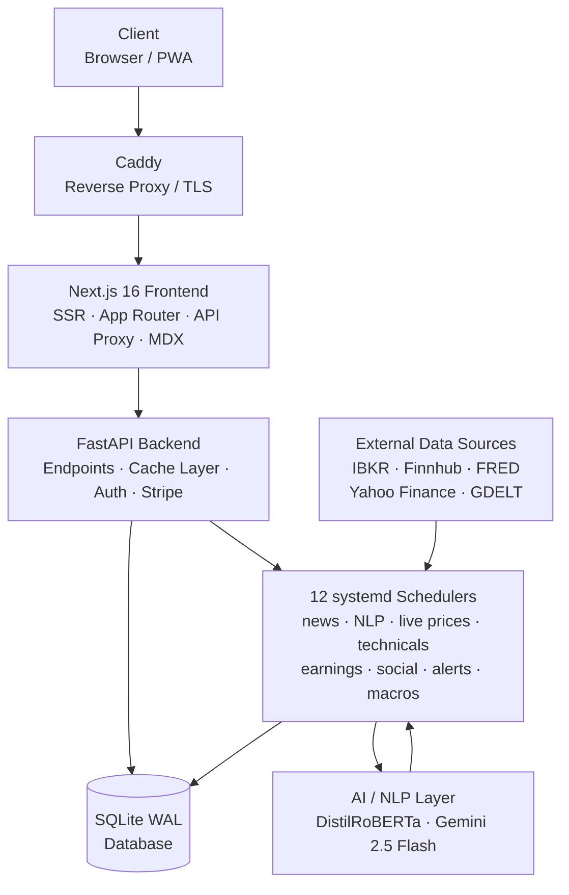
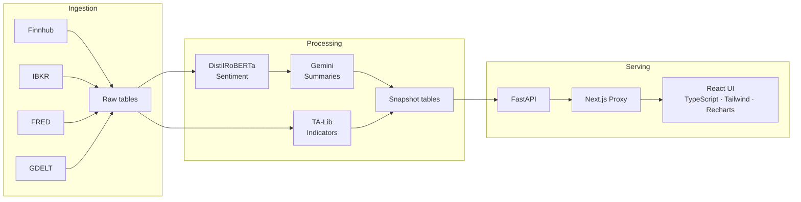

<picture>
  <source media="(prefers-color-scheme: dark)" srcset="assets/daily-iq-topbar-logo.svg">
  <source media="(prefers-color-scheme: light)" srcset="assets/daily-iq-topbar-logo-black.svg">
  
</picture>

**Real-time market intelligence platform — live prices, NLP-driven sentiment, technical analysis, and portfolio tools for 875+ equities and ETFs.**

---

## Platform at a Glance

| Monthly Page Views | Tracked Securities | API Endpoints | Content Pages |
|:---:|:---:|:---:|:---:|
| **13,000+** | **875+ equities & ETFs** | **136 REST endpoints** | **2,171 MDX pages** |

---

## System Architecture

---

## Data Flow

---

## Tech Stack

| Layer | Technologies |
|-------|-------------|
| **Frontend** | Next.js 16, React 19, TypeScript 5, Tailwind CSS v4, Recharts, MDX |
| **Backend** | Python 3.12, FastAPI, Uvicorn, Pydantic |
| **Database** | SQLite (WAL mode) — concurrent readers, single writer, retry-aware helpers |
| **NLP / AI** | HuggingFace Transformers (DistilRoBERTa), Google Gemini 2.5 Flash, 300+ term financial lexicon |
| **Technical Analysis** | TA-Lib (RSI, MACD, Bollinger Bands, Stochastic, CCI) |
| **Data Sources** | Interactive Brokers, Finnhub, Yahoo Finance, FRED, GDELT |
| **Infrastructure** | DigitalOcean VPS, Ubuntu, Caddy, systemd, PM2 |
| **Auth & Payments** | JWT (HS256), Google OAuth, bcrypt, Stripe |

---

## Feature Overview

**Live Price Streaming**
IBKR subscriptions are managed via a TTL-based model — each frontend API touch registers a 3-minute subscription lease. A background poller rescans every 5 seconds, subscribes active symbols, deduplicates ticks (price delta or 8-second force write), and batch-writes to SQLite. If live data goes stale beyond 20 seconds, the API automatically falls back to the latest batch price.

**Two-Stage NLP Pipeline**
Raw news articles are first scored by a fine-tuned DistilRoBERTa model augmented with a 300+ term financial lexicon, producing per-article sentiment labels and confidence scores. A second pass through Gemini 2.5 Flash aggregates signals across sources and generates structured summaries, insight callouts, and watchlist impact assessments at the symbol level.

**Technical Analysis Engine**
TA-Lib computes RSI, MACD, Bollinger Bands, Stochastic, and CCI across multiple timeframes for every tracked security. Results are persisted to a `technicals_cache` table and rolled into denormalized snapshot tables, making indicator reads a single indexed query with no runtime computation.

**Snapshot Architecture**
All high-traffic API responses are served from precomputed snapshot tables (`price_symbol_snapshot`, `sentiment_and_technicals_snapshot`, `ultimate_overview`). Nightly and intraday builder scripts read from raw tables, aggregate, and overwrite snapshots atomically. This decouples query latency from data complexity while keeping the API response times under 50ms.

**MDX Content System**
2,171 stock and ETF pages were generated through a fully automated pipeline: company data is assembled into structured prompts, sent to Gemini 2.5 Flash in batches of three symbols with five separate section calls each, and the resulting JSON is assembled into typed MDX files. Pages are statically compiled at build time — zero CMS dependency, full TypeScript type safety.

---

## Infrastructure & Deployment

DailyIQ runs on a single DigitalOcean VPS.

- **Caddy** handles TLS termination and reverse proxying
- **Background services** run the backend scheduler workers independently; each owns one domain (news, NLP, live prices, technicals, earnings, social posts, user alerts, macro calendar) and uses database-backed leases to prevent duplicate instances
- **PM2** manages the Next.js frontend process with automatic restart on crash
- **SQLite WAL mode** provides concurrent read access for API endpoints alongside single-writer batch scripts, with custom retry helpers implementing up to 50 retries with exponential backoff

---

*This repository contains architecture documentation only. The source code is not inside of this repo.*

[dailyiq.me](https://dailyiq.me)

