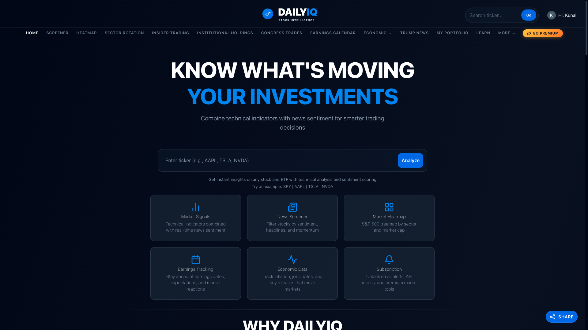
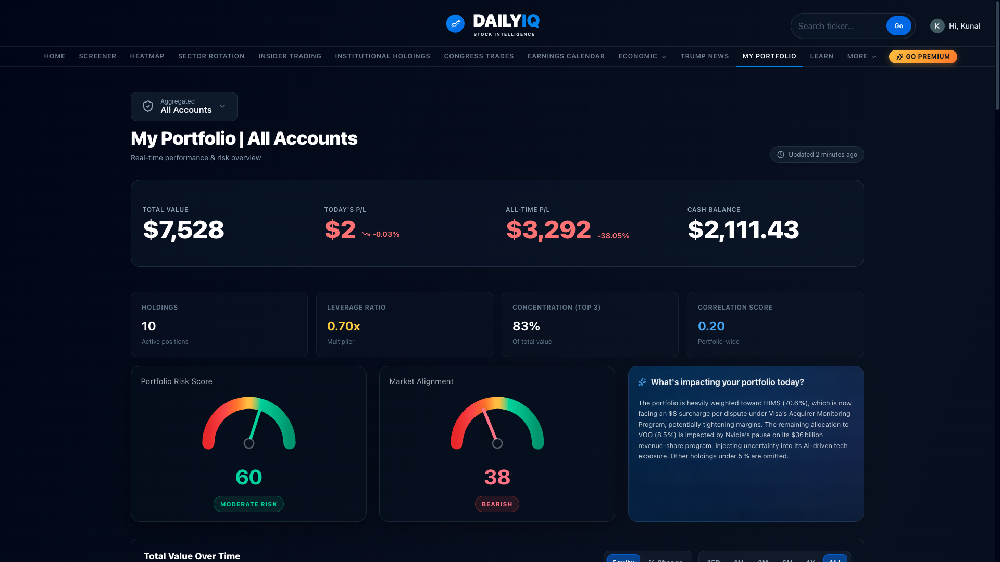
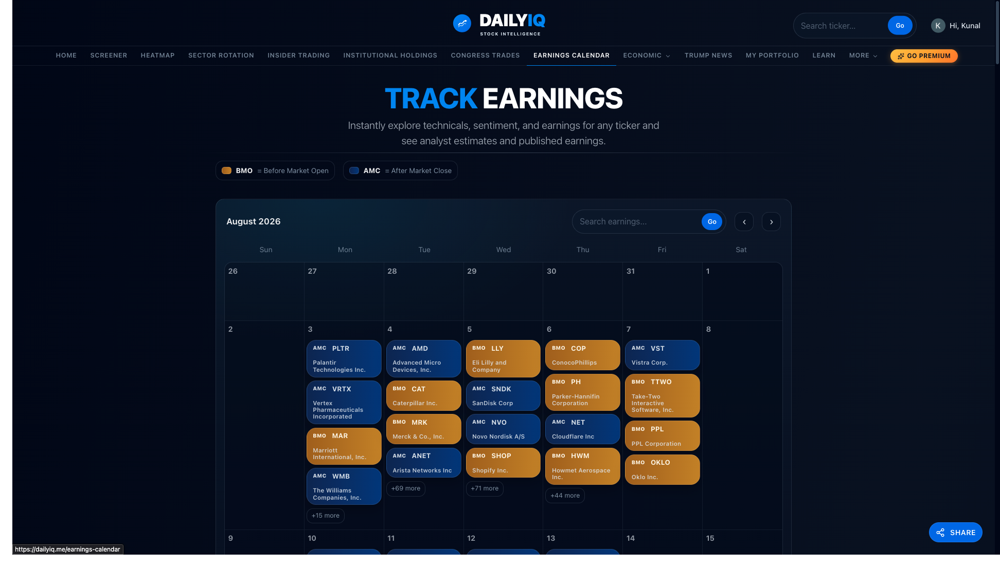
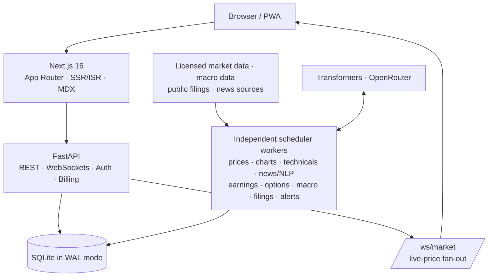

<picture>
  <source media="(prefers-color-scheme: dark)" srcset="assets/daily-iq-topbar-logo.svg">
  <source media="(prefers-color-scheme: light)" srcset="assets/daily-iq-topbar-logo-black.svg">
  
</picture>

**Real-time market intelligence for stocks and ETFs — live pricing, technical and sentiment analysis, research, and portfolio tools.**

---

## Platform at a glance

DailyIQ tracks **1,195 securities** (1,051 stocks and 144 ETFs). It combines precomputed market snapshots with live-price updates to keep high-traffic research pages responsive.

| Tracked securities | Technical timeframes | Live delivery paths | Research domains |
| :---: | :---: | :---: | :---: |
| **1,195** | **8** | **REST + WebSockets** | **Markets, fundamentals, news, macro, filings, options** |

| Area | What it provides |
| --- | --- |
| Market research | Stock, ETF, futures, sector, macro, earnings, news, and options views |
| Analysis | Technical indicators, multi-timeframe signals, sentiment, DCF/fair-value, price targets, and market-regime context |
| Ownership activity | Insider trades, congressional trades, institutional 13F holdings, and short interest |
| Investor tools | Screeners, heatmaps, watchlists, portfolios, price alerts, and Questrade integration |
| Content | Generated stock/ETF/earnings/sector MDX pages plus a hand-authored Learn Center |
| Platform services | Auth, subscriptions and Stripe billing, user/admin API keys, sharing, email alerts, and a PWA |

## Product previews

<table>
  <tr>
    <td width="50%">
      
      
<strong>Market intelligence</strong> Research any supported security from a single starting point.

    </td>
    <td width="50%">
      
      
<strong>Portfolio context</strong> Track performance, risk, concentration, and market alignment.

    </td>
  </tr>
  <tr>
    <td colspan="2">
      
      
<strong>Earnings intelligence</strong> Explore upcoming results, estimates, and market-moving events.

    </td>
  </tr>
</table>

## Architecture

```mermaid
flowchart TD
    Browser[Browser / PWA] --> Next[Next.js 16\nApp Router · SSR/ISR · MDX]
    Next --> API[FastAPI\nREST · WebSockets · Auth · Billing]
    API --> DB[(SQLite in WAL mode)]
    Schedulers[Independent scheduler workers\nprices · charts · technicals · news/NLP\nearnings · options · macro · filings · alerts] --> DB
    Sources[Licensed market data · macro data\npublic filings · news sources] --> Schedulers
    AI[Transformers · OpenRouter] <--> Schedulers
    API --> WS[/ws/market\nlive-price fan-out/]
    WS --> Browser
```

### Core design decisions

- **SQLite WAL:** concurrent readers with a single writer, backed by retry-aware connection helpers and short-lived endpoint sessions.
- **Snapshot-first API:** raw historical data feeds `price_symbol_snapshot`, sentiment/technical snapshots, and `ultimate_overview`, keeping expensive aggregation out of request paths.
- **Independent workers:** each scheduler owns its domain and uses database-backed leases to avoid duplicate pollers. Production runs these workers as separate systemd services.
- **SSR, ISR, and static generation:** stock pages revalidate hourly, ETF pages every five minutes, and slow server sections stream behind Suspense boundaries.
- **Secure proxy boundary:** public browser traffic stays same-origin through Next.js; backend URLs and internal cache controls are not exposed as client configuration.

## Feature overview

### Live market data and charts

DailyIQ combines data from licensed market-data providers with its own snapshot and streaming layers to deliver responsive quotes and charts. Price pages, watchlists, historical bars, futures, and options surfaces share this data foundation.

### Technical, fundamental, and quantitative research

The analysis stack includes RSI, MACD, Bollinger Bands and other technical indicators; multi-timeframe signal aggregation; momentum screening; sector rotation; market heat/regime views; financial statements; analyst targets; DCF snapshots; earnings data; and options pricing/Greeks. Signals research and paper-trading tools live under internal development routes.

### News and AI analysis

News ingestion, sentiment scoring, and AI-generated summaries are handled outside the request path. The platform uses Hugging Face Transformers for NLP and OpenRouter for generated research content and summaries. Generated content is quality- and indexing-gated before publishing.

### Ownership, macro, and event intelligence

DailyIQ surfaces SEC insider filings, House STOCK Act disclosures, 13F institutional holdings, FINRA short interest, economic calendars and reports, FRED-backed macro context, earnings calendars, and related market news.

### Investor accounts and alerts

Users can manage portfolios, holdings, journals, watchlists, price alerts, subscriptions, and API keys. Authentication uses signed JWT sessions with email and Google OAuth flows; premium billing is managed through Stripe. Questrade account data can be synchronized for supported portfolio views.

## Tech stack

| Layer | Technologies |
| --- | --- |
| Frontend | Next.js 16, React 19, TypeScript, Tailwind CSS v4, Recharts, MDX |
| Backend | Python, FastAPI, Uvicorn, Pydantic |
| Data | SQLite WAL, market-data providers, macro and public-filings sources |
| AI and analytics | Hugging Face Transformers, OpenRouter, TA-Lib, custom financial models |
| Operations | Linux/systemd workers, GitHub Actions deployment, reverse proxy/TLS infrastructure |
| Identity and payments | JWT, bcrypt, Google OAuth, Stripe |

## Public architecture overview

This repository is intentionally an architecture and product overview. Application source code, credentials, operational configuration, and deployment internals are private.

[dailyiq.me](https://dailyiq.me)

